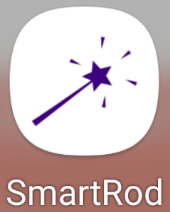

# 건국대학교 졸업 프로젝트 smart rod

## Introduction
시각장애인들을 위한 보행 안전 보조 APP

## Details
 * 보행 시 장애물 인식 후 음성으로 사전 안내
 * 사용 중 긴급 연락 기능
 * 현재 위치 기준 주변 건물 음성으로 안내

## Dependency
 * python 3.x
 * opencv 4.x  
 * labeling tool : labelImg
 * NN : most outstanding NN among YOLOv4 / SSD / MobileNet 
 * DBMS : postgreSQL
 * location : 건국대학교 부지 내

